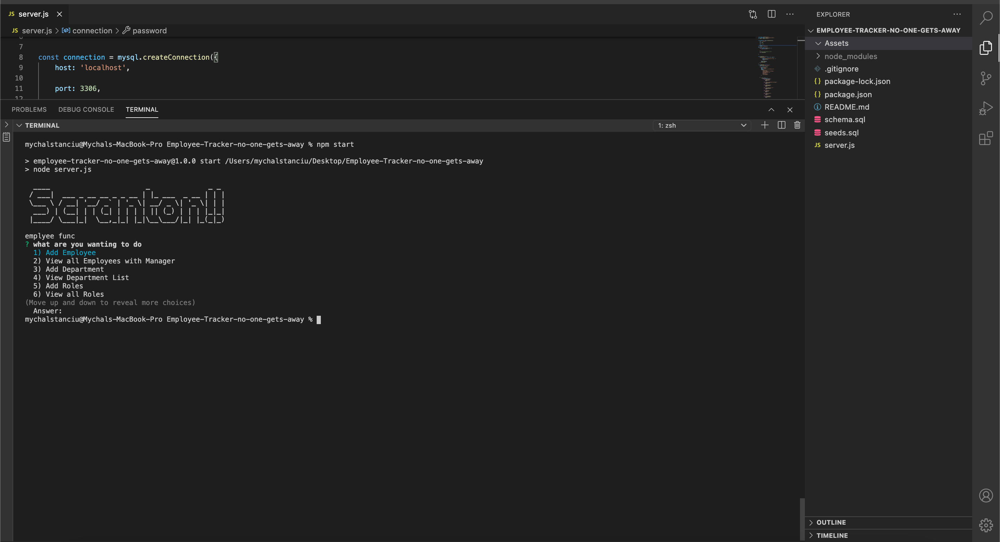
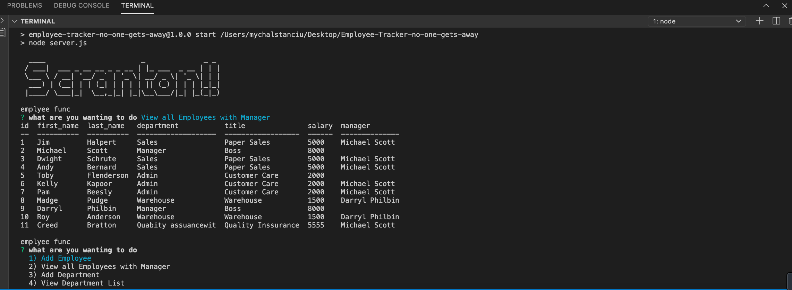

# Employee-Tracker-no-one-gets-away

# Links
* [GithubRepo](https://github.com/Chapstick24/Employee-Tracker-no-one-gets-away)
* [Link to this app in action](chrome-extension://mmeijimgabbpbgpdklnllpncmdofkcpn/ng/app/app.html#/files/ebfd4a67-69d0-4ca2-y9f9-c2f435c7a6d3)

## Checklist

* create/ build folder and files, as such schema, seeds, server. 

* install express, mySQL, inquirer, console table.

* build seprate tables for departments, roles and Employees. 
* **department**:

  * **id** - INT PRIMARY KEY
  * **name** - VARCHAR(30) to hold department name

* **role**:

  * **id** - INT PRIMARY KEY
  * **title** -  VARCHAR(30) to hold role title
  * **salary** -  DECIMAL to hold role salary
  * **department_id** -  INT to hold reference to department role belongs to

* **employee**:

  * **id** - INT PRIMARY KEY
  * **first_name** - VARCHAR(30) to hold employee first name
  * **last_name** - VARCHAR(30) to hold employee last name
  * **role_id** - INT to hold reference to role employee has
  * **manager_id** - INT to hold reference to another employee that manages the employee being Created. This field may be null if the employee has no manager

* Build a command-line application:

  * Add departments, roles, employees

  * View departments, roles, employees

  * Update employee roles

  * Update employee managers

  * View employees by manager

  * Delete departments, roles, and employees

  * View the total utilized budget of a department -- ie the combined salaries of all employees in that department

  # Screen Shots
  

  
  